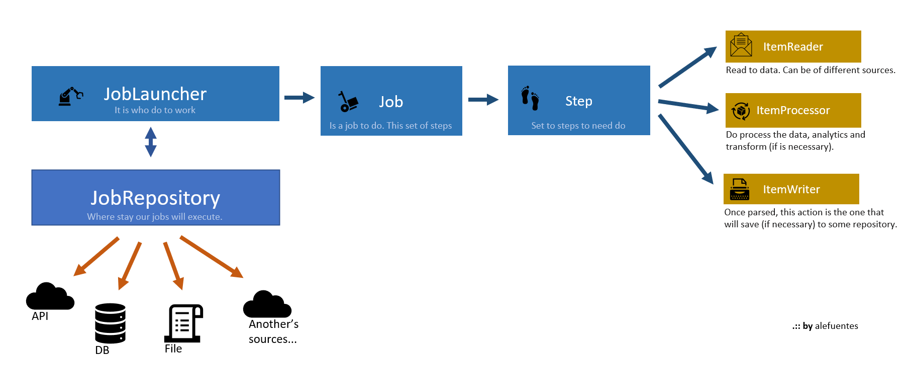

## Spring Batch | with MySQL


## Introduction

This project is a simple use of Spring Batch, that allows us execute process of batch  
This technology allows us to integrate with other Spring modules, like this example that uses Spring Data MySql to persist data data.
Your activity is get data of flat file `.CSV` and to save in a table of DB `MySQL`.

<p align = "center">

</p>
<p align = "center">
Fig.1 - A Little explanation about spring batch
</p>

This idea is a simple and little example where the Job Batch get datas of flat file and before of process, save in a table of `MySql`. 
## Starting

some tips for use this code

1. **clone project** in some folder of work
    ```
    $ git clone https://github.com/ale-fuentes/SPRINGBATCH_with_MySQL.git
    ```
1. **import Maven project**, with our IDE, import the project, install dependencies, and execute.
1. **verify configuration MySQL**, in the file `resources\application.properties`:
   ```properties
   spring.datasource.url=jdbc:mysql://localhost:3306/<name-your-schema-or-db>?useUnicode=true&useJDBCCompliantTimezoneShift=true&useLegacyDatetimeCode=false&serverTimezone=UTC
   spring.datasource.username=guest
   spring.datasource.password=guest
   ```
1. **testing batch**, execute `main` method of project (or class) `SpringbatchWithMySqlApplication`.